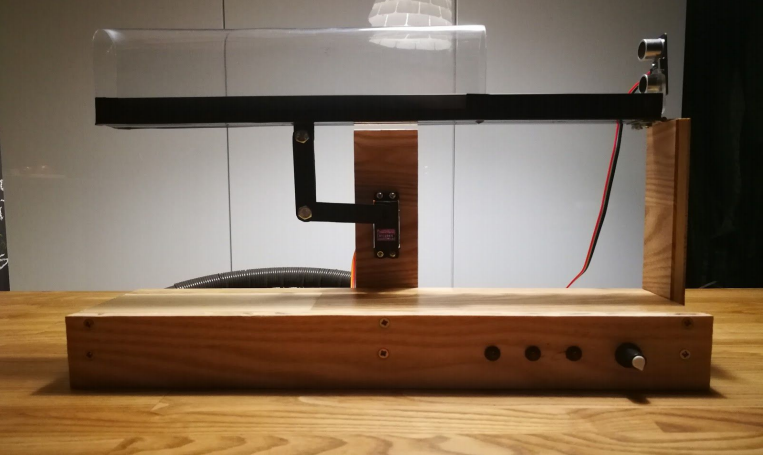

# PID-regulator

### [Opis projektu](https://drive.google.com/file/d/1YQ7Bymh5CCV7hIchWDSn_JDqjq_D5z_C/view?usp=sharing)
### [działanie urządzenia [1]](https://drive.google.com/file/d/1ugVkFqK55OKaZUdhush3DiUtvRxWjR2D/view?usp=sharing)
### [działanie urządzenia [2]](https://drive.google.com/file/d/1P5vMSABmQK9ASjgPXgTZhG_p2E-9JBaL/view?usp=sharing)

